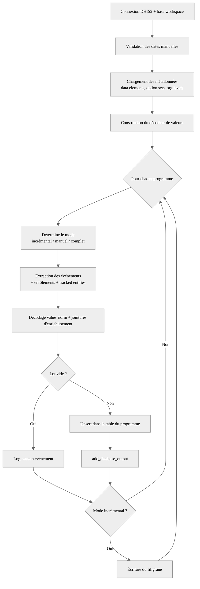

# Pipeline d'extraction des trackers MVE (DHIS2)

## Description

Ce pipeline OpenHexa extrait les événements des **deux programmes tracker MVE**
(17ᵉ épidémie de Maladie à Virus Ebola, COUSP-RDC) depuis une instance DHIS2,
les enrichit et les persiste dans une table de base de données dédiée par
programme :

- `mve_notification` (`wDFB7FFlYQM`) — Notification d'alerte et investigation de cas
- `mve_contacts` (`wyLS271t8Id`) — Fiche d'identification et suivi individuel des contacts

Pour chaque programme, le pipeline :

1. charge une fois les **métadonnées** de l'instance (data elements par stage,
   option sets, niveaux d'org units) ;
2. extrait les **événements au format long** (une ligne par couple
   événement × data element) ;
3. les **enrichit** par jointure avec les enrôlements (date d'inscription), les
   tracked entities (num_epid, sexe, âge…), les libellés des data elements et la
   hiérarchie géographique ;
4. **décode** les valeurs codées (option sets, y compris `MULTI_TEXT`) dans une
   colonne `value_norm` ;
5. **upsert** le résultat dans la table cible au grain `event_id`.

La table longue produite est la source d'agrégation des indicateurs du SitRep
MVE (voir `code/generate_sitrep/`).

## Extraction incrémentale

Le pipeline tient un **filigrane** (table d'état `dhis2_extract_state`,
horodatage de la dernière exécution réussie par programme). Par défaut, seuls
les événements **créés ou modifiés depuis le dernier run** sont ré-extraits
(filtre `updatedAfter`), ce qui rejoue automatiquement les soumissions
corrigées. Les événements supprimés sont aussi ramenés (`includeDeleted`) pour
propager les suppressions lors de l'upsert.

Le mode est déterminé ainsi :

| Situation | `updatedAfter` appliqué |
|---|---|
| Première exécution (pas de filigrane) | aucun (extraction complète) |
| Exécution suivante | filigrane de la dernière exécution (incrémental) |
| Fenêtre manuelle (`occurred_after`/`occurred_before`) | aucun (le filigrane n'est ni lu ni écrit) |
| Rechargement complet (`full_refresh`) | aucun (ré-extraction de tout l'historique) |

## Paramètres

| Paramètre | Type | Requis | Défaut | Description |
|-----------|------|--------|--------|-------------|
| Connexion DHIS2 (`dhis_con`) | DHIS2 Connection | Oui | – | Connexion à l'instance tracker MVE |
| Unité d'organisation racine (`org_unit_parent`) | String (widget Org Units) | Non | `ymGeqzoPhN3` | UID de l'org unit dont on extrait les descendants (`DESCENDANTS`) |
| Événements depuis (`occurred_after`) | String | Non | – | Fenêtre manuelle par date de survenue (`YYYY-MM-DD`). Vide = extraction incrémentale depuis la dernière exécution |
| Événements jusqu'à (`occurred_before`) | String | Non | – | Borne supérieure de la fenêtre manuelle (`YYYY-MM-DD`, optionnel) |
| Rechargement complet (`full_refresh`) | Boolean | Non | `False` | Ignore le filigrane et ré-extrait tout l'historique (upsert) |

> Les dates manuelles sont validées au format `YYYY-MM-DD` ; un format invalide
> arrête le pipeline avec une erreur explicite.

## Sortie

Le pipeline écrit **une table de base de données par programme** dans la base du
workspace (`workspace.database_url`) :

- `mve_notification_events`
- `mve_contacts_events`

Chaque table est mise à jour par **upsert au grain `event_id`** : toutes les
lignes d'un `event_id` présent dans le lot sont remplacées (staging → suppression
des clés correspondantes → insertion), de sorte que l'ajout/suppression de data
values d'une soumission corrigée soit fidèlement reflété. Les nouvelles colonnes
apparues côté source sont ajoutées automatiquement à la table cible.

Une table d'état `dhis2_extract_state` (`program`, `last_run_at`) porte le
filigrane incrémental.

### Structure de la table de sortie (format long)

Une ligne par couple (événement × data element). Colonnes principales :

| Colonne | Origine | Description |
|---|---|---|
| `event_id` | événement | Clé d'upsert |
| `status`, `deleted` | événement | Statut et drapeau de suppression |
| `program_id`, `program_stage_id`, `program_stage_name` | événement / métadonnées | Programme et stage |
| `tracked_entity_id`, `enrollment_id` | événement | Cas et enrôlement |
| `organisation_unit_id`, `level_{n}_name` | événement / hiérarchie géo | Org unit et libellés de niveau (province, ZS, AS…) |
| `occurred_at`, `created_at`, `updated_at` | événement | Horodatages |
| `enrolled_at`, `enrollment_org_unit` | enrôlement | Date et org unit d'inscription |
| `data_element_id`, `data_element_name`, `value_type`, `option_set_id` | événement / métadonnées | Data element |
| `value` | événement | Valeur brute (code stocké) |
| `value_norm` | calculé | Valeur décodée (libellé d'option ; texte/date/numérique conservés tels quels) |
| *attributs TEI* | tracked entity | num_epid, sexe, âge, date de notification… (une colonne par attribut) |

## Validation

- Le format des paramètres `occurred_after` / `occurred_before` est validé
  (`YYYY-MM-DD`) avant toute extraction.
- Un programme sans événement nouveau/modifié n'écrit rien (log d'information) et
  ne provoque pas d'échec.
- L'upsert ne tourne que sur des lots non vides ; le filigrane n'est écrit qu'en
  mode incrémental (pas en fenêtre manuelle).

## Flux du pipeline



## Structure du projet

| Fichier | Rôle |
|---|---|
| `pipeline.py` | Point d'entrée OpenHexa : paramètres, orchestration, logique incrémentale |
| `toolbox.py` | Extraction et enrichissement DHIS2 (événements, enrôlements, TEI, métadonnées, décodage) |
| `db_operations.py` | Filigrane (lecture/écriture) et upsert au grain `event_id` |
| `config.py` | Constantes : programmes, org unit racine, taille de page, clés |
| `requirements.txt` | Dépendances Python |
| `tests/` | Tests pytest (logique incrémentale, décodage, enrichissement) |

## Développement local

Dépendances dans `requirements.txt` (openhexa-sdk, openhexa-toolbox, polars,
sqlalchemy, psycopg2-binary…).

Le dépôt héberge deux pipelines OpenHexa exposant chacun un module `config`
importé en nom nu. Les tests insèrent le dossier du pipeline en tête de
`sys.path` (`tests/conftest.py`) ; lancer la suite **isolément** :

```bash
uv run pytest code/dhis2_tracker_extract/tests
uv run ruff check code/dhis2_tracker_extract/
uv run ruff format code/dhis2_tracker_extract/
```
